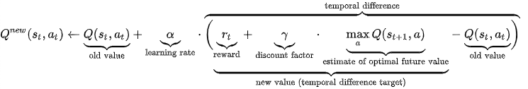
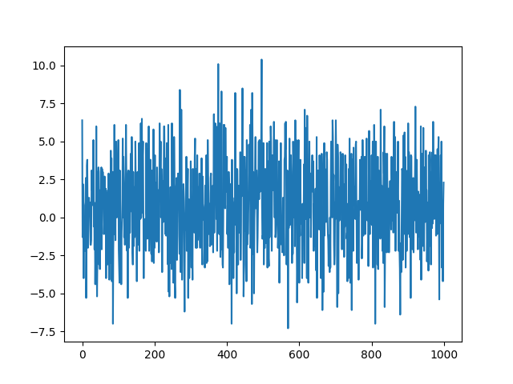
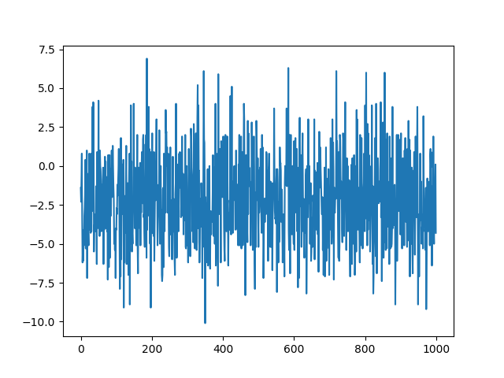

# Trabalho Prático 2 de Introdução à Inteligência Artificial

_Julia Tiemi Alkmim Morishita e Marcelo Luiz Harry Diniz Lemos_

### 1. Introdução

Esse trabalho consiste em ajudar Márcio novamente. Na primeira parte do trabalho, ajudamos ele a programar um AGV - _Automated Guided Vehicle_ - que percorre sua fábrica, coletando a produção. Definimos as rotas do veículo a partir de um mapa estático utilizando quatro algoritmos de busca para encontrar o menor caminho entre o ponto inicial de cada instalação até o ponto de coleta. Nesse segundo trabalho prático, vamos resolver o mesmo problema, mas com o uso de aprendizado por reforço.

### 2. Implementação

A solução da tarefa envolve um agente que resolve o problema através de apredizado por reforço. Isso quer dizer que ele aprende ao interagir com o ambiente. A cada ação que o agente executa, ele recebe uma recompensa de acordo com seu resultado. Assim, o objetivo central desse agente é maximizar a recompensa total. O ambiente foi modelo por um Processo de Decisão de Markov, no qual:

$S$ é um espaço de estados, que contém todos os possíveis estados que o sistema pode estar. No caso, representado pelos pontos no mapa que são navegáveis ('\$', '.' e '#').
$A$ é o espaço de ações, que contém todas as ações que o agente pode realizar dentro do sistema. No caso, elas são andar para cima, baixo, direita ou esquerda.
$r$ : $SxAxS$ $\rightarrow$ $R$ é a função de recompensa. No caso, um passo para um ponto vale $-1$, para um ponto de localização, $+1$, bater em uma parede ou se perder, $-10$ e chegar ao objetivo, $+10$.
$\gamma$ é o valor de desconto. Ele determina o quanto recompensas futuras devem ser desconsideradas ao tomar uma decisão. Isso significa que um $\gamma = 0$ visa maximizar a recompensa de agora, sem pensar nas futuras. Por outro lado, um $\gamma = 1$ indica que recompensas de um futuro distante são tão importantes quando as deste momento.

Nesse problema, utilizamos apredizado por diferença temporal. A ideia por trás disso é atualizar a função de valor do estado considerando a diferença entre o valor atual e a estimativa de um novo valor, obtido a partir da fórmula:

Na qual o valor novo de $Q$ é um par (estado ($s$), ação ($a$)) que depende da uma taxa de aprendizado ($\alpha$), multiplicada pela soma da recompensa ($r$) com o fator de desconto ($\gamma$) aplicado ao valor de $Q$ da melhor ação do estado subsequente, subtraído do valor anterior.

Então, para cada estado $s$ do nosso mapa, temos 4 valores de $Q$. A cada passo dado, esse valor é calculado diversas vezes. A priori, sempre selecionamos a melhor ação. para melhorar o algoritmo, introduze-se o $\epsilon$ - greedy. Essa variável muda a forma como a ação é escolhida, tornando-a mais aleatória. Dessa maneira, depois de vários episódios, existe a possibilidade de visitarmos estados que seriam descartados sem a presença dessa modificação e que podem levar a um resultado mais interessante.

A implementação desse problema começa o carregamento do mapa e aquisição das variáveis passadas por parâmetro $\alpha, \epsilon, \gamma$ e o número de episódios $N$. Então, o agente será treinado $N$ vezes dentro da classe $Learning\_Agent$.

A partir de uma posição inicial escolhida aleatoriamente que será seu estado inicial, ele decidirá seu passo seguinte. Em $choose\_action()$, ele sorteia um valor para comparar com $\epsilon$, para saber se vai tomar a melhor ação ou uma aleatória. Feito sua escolha, ele pode prosseguir, somar a recompensa e fazer a atualização do valor de Q segundo a equação mostrada acima.

O agente repete isso até encontrar uma parede, ficar preso ou encontrar o objetivo. Qualquer uma dessas ações termina o episódio, podendo começar um novo logo em seguida.

### 3. Resultados

#### 3.1 Política

A política encontrada foi satisfatória. Analisando o arquivo pi.txt, é possível perceber que o agente está convergindo para a política ótima de acordo com as recompensas que ele recebe em cada posição do mapa. 

#### 3.2 Gráficos de Aprendizado

Os resultados encontrados nesta parte do projeto foram um pouco inesperados. Apesar de que os arquivos gerados com a política aprendida foram sempre satisfatórios como dito acima, os gráficos de aprendizado gerados para diversos valores de $\alpha$ e $\gamma$ sempre se pareciam com as imagens abaixo. 

O esperado era que as recompensas fossem aumentando gradualmente a cada episódio até convergir para um ponto máximo, mas isso não foi observado.

### 4. Discussão dos Resultados

Surgimos com algumas suposições para o motivo dos resultados encontrados. Sobre o formato do gráfico, é muito possível que isso tenho sido causado pelo valor constante do $\epsilon$. O comportamento dele se mostrou o mesmo independente de quão grande ou pequeno ele era.

Tentamos fazer com $\epsilon = 0$, mas devido ao valor da recompensa em pontos de localização ser $1$, nosso agente ficava preso em loops entre dois desses pontos, buscando maximizar sua recompensa final.

O valor das recompensas especificado gerou esse tipo de problema, por isso, o agente mostrou melhores resultados alterando o valor da recompensa em pontos de localização para $0$.

Também tentamos fazer um $\epsilon$ com decaimento, mas isso não teve muito impacto nos gráficos de aprendizado, apenas tornando sua amplitude menor.